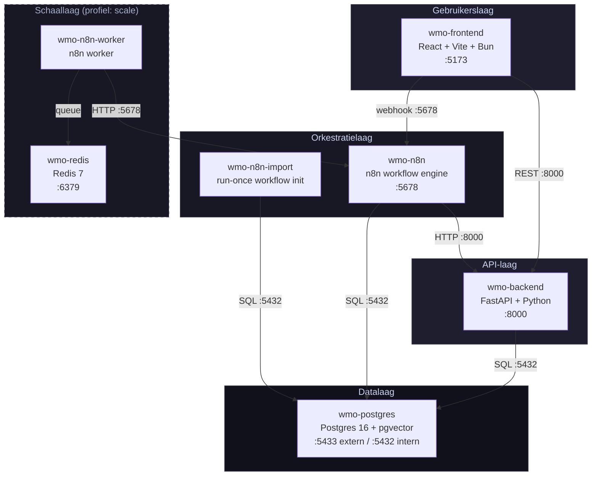
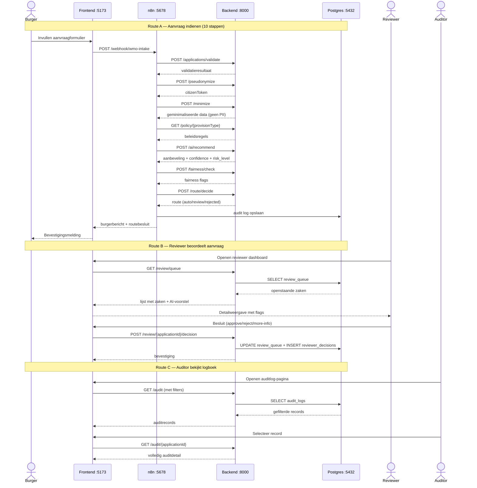
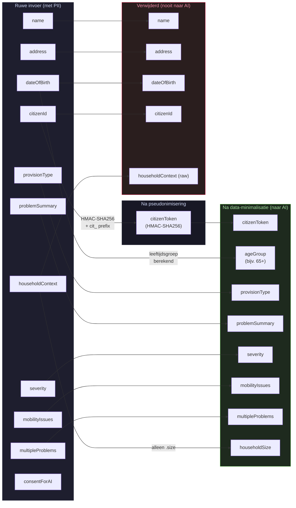

# Architectuuroverzicht — WMO Zorgagent

**Versie:** 1.0  
**Datum:** April 2026  
**Taalniveau:** B1, professioneel

Dit document beschrijft de technische opbouw van het WMO Zorgagent prototype. Het prototype verwerkt WMO-aanvragen sneller, zorgvuldiger en privacyvriendelijker met AI-ondersteuning en workflow-automatisering.

---

## 1. Containerarchitectuur

Dit diagram laat zien welke Docker-services er zijn, hoe ze met elkaar verbonden zijn en op welke poorten ze bereikbaar zijn.

**Toelichting poorten:**

| Service | Intern | Extern | Doel |
|---|---|---|---|
| wmo-frontend | 5173 | 5173 | React dev-server |
| wmo-backend | 8000 | 8000 | FastAPI REST |
| wmo-n8n | 5678 | 5678 | Webhook + UI |
| wmo-postgres | 5432 | 5433 | SQL database |
| wmo-redis | 6379 | 6379 | Queue (scale-profiel) |

---

## 2. Datastromen

Dit diagram laat zien welke stappen worden doorlopen van aanvraag tot besluit, reviewer-beoordeling en auditinzage.

---

## 3. Data-minimalisatie pijplijn (AVG)

Dit diagram laat zien welke velden worden verwijderd voor de AI-aanroep en welke privacyveilige velden overblijven.

**Wat gaat door naar AI, fairness-check en audit:**
- citizenToken, ageGroup, provisionType, problemSummary, severity, mobilityIssues, multipleProblems, householdSize

**Wat nooit de backend verlaat richting AI-services:**
- naam, adres, exacte geboortedatum, burger-ID (citizenId), ruwe householdContext

---

## 4. Componentbeschrijving

### Frontend — `wmo-frontend`

De frontend is gebouwd in React 18 met Vite als build-tool en TypeScript in strict-mode. Bun wordt gebruikt als package manager en runtime. De stijl volgt een Linear-geïnspireerde dark-mode SaaS UI op basis van Tailwind CSS en shadcn/ui-componenten.

De frontend biedt drie schermen:

- **Intake/Test**: aanvraagformulier of directe JSON-submit voor testcases, met live response-weergave.
- **Reviewer Dashboard**: overzicht van alle zaken in de review-wachtrij, detailpaneel met AI-voorstel, fairness-vlaggen en knoppen voor approve, reject of more-info.
- **Auditlog**: gefilterde tabel van alle auditrecords met detailpaneel per record.

De frontend communiceert via twee kanalen: intake-aanvragen gaan rechtstreeks naar de n8n webhook (`VITE_N8N_WEBHOOK_URL`), reviewer- en auditpagina's communiceren met de backend-REST-API (`VITE_API_BASE_URL`).

**Poort:** 5173  
**Afhankelijkheid:** wmo-backend, wmo-n8n

---

### n8n Workflow Engine — `wmo-n8n`

n8n verzorgt de orkestratie van het intake-proces. De workflow is opgeslagen als JSON-bestand (`n8n/workflows/wmo.json`) en wordt bij elke start automatisch geladen via de `wmo-n8n-import`-container.

De workflow bestaat uit zes secties met tien stappen:

1. Webhook-trigger (intake-aanvraag ontvangen)
2. Validatie via `POST /applications/validate`
3. Pseudonimisering via `POST /pseudonymize`
4. Data-minimalisatie via `POST /minimize`
5. Policy ophalen via `GET /policy/{provisionType}`
6. AI-aanbeveling via `POST /ai/recommend`
7. Fairness-check via `POST /fairness/check`
8. Route bepalen via `POST /route/decide` (switch met drie lanes: auto, review, rejected)
9. Audit log opslaan
10. Response + burgerbericht teruggeven aan de frontend

Complexe bedrijfslogica zit bewust in de FastAPI-backend; n8n doet uitsluitend routing en orkestratie. De n8n-database wordt opgeslagen in dezelfde Postgres-instantie als de backend (aparte tabellen).

**Poort:** 5678  
**Afhankelijkheid:** wmo-postgres, wmo-backend  
**Schaaloptie:** `wmo-n8n-worker` + `wmo-redis` (Docker Compose-profiel `scale`)

---

### Backend — `wmo-backend`

De backend is geschreven in Python 3.11 met FastAPI als webframework, Pydantic v2 voor invoer- en uitvoervalidatie, SQLAlchemy 2 als ORM en Uvicorn als ASGI-server.

De backend is opgedeeld in losse modules:

| Module | Doel |
|---|---|
| `routes/applications.py` | POST /applications, validate, pseudonymize, minimize, route/decide |
| `routes/ai.py` | POST /ai/recommend |
| `routes/fairness.py` | POST /fairness/check |
| `routes/policy.py` | GET /policy/{provisionType} |
| `routes/review.py` | GET /review/queue, POST /review/{id}/decision |
| `routes/audit.py` | GET /audit, GET /audit/{id} |
| `routes/citizen.py` | GET /citizen/{token}/data (AVG inzageverzoek) |
| `routes/health.py` | GET /health |
| `services/ai_stub.py` | Deterministische AI-stub (geen externe API) |
| `services/fairness.py` | Fairness-check via blocklist |
| `services/minimizer.py` | PII-stripper + leeftijdsgroep-afleiding |
| `services/pseudonymizer.py` | HMAC-SHA256 tokenisering |
| `services/router.py` | Routeringslogica |
| `services/audit.py` | Audit log + review queue schrijven |
| `core/config.py` | Configuratie via environment variables |
| `core/fairness_blocklist.yaml` | Uitbreidbare lijst met verboden termen |

**Poort:** 8000  
**Afhankelijkheid:** wmo-postgres

---

### Database — `wmo-postgres`

De database draait op Postgres 16 met de pgvector-extensie voor toekomstige RAG-integratie op beleidsregels. Het schema wordt bij opstarten aangemaakt via SQLAlchemy `Base.metadata.create_all()`.

De database bevat vier tabellen:

| Tabel | Doel |
|---|---|
| `applications` | Metadata per ingediende aanvraag |
| `audit_logs` | Volledige audittrail per aanvraag (EU AI Act, AVG) |
| `review_queue` | Openstaande en afgehandelde reviewzaken |
| `reviewer_decisions` | Besluiten van menselijke beoordelaars |
| `policy_embeddings` | Vectorstore voor beleidsregels (pgvector, voor toekomstige RAG) |

Postgres wordt ook gebruikt als queue-backend voor n8n (workflow-status, job-geschiedenis).

**Poorten:** 5432 (intern), 5433 (extern voor ontwikkeltools)  
**Image:** `pgvector/pgvector:pg16`

---

## 5. Observability en compliance

### Healthchecks

| Service | Methode | Interval |
|---|---|---|
| wmo-backend | HTTP GET /health | 10s |
| wmo-postgres | `pg_isready -U wmo -d wmo` | 5s |

De backend-healthcheck wacht tot de database bereikbaar is (`depends_on: postgres: condition: service_healthy`). Hierdoor start de backend pas als Postgres klaar is.

### Audittrail (AVG en EU AI Act)

Elk verwerkt verzoek krijgt een auditrecord in de tabel `audit_logs`. De auditrecords bevatten:

- `application_id` — unieke aanvraagidentifier (UUID)
- `citizen_token` — pseudoniem (nooit het echte burger-ID)
- `provision_type`, `severity`, `route`, `risk_level`
- `fairness_flags` — lijst van gedetecteerde verboden termen
- `ai_recommendation`, `ai_reasoning`, `ai_model`, `ai_confidence`
- `final_decision_status` — eindstatus van de aanvraag
- `processing_purpose` — doelbinding (standaard: `wmo_intake`)
- `retention_until` — vervaldatum (standaard: aanmaakdatum + 90 dagen, via `RETENTION_DAYS`)
- `created_at` — tijdstip van aanmaak

### EU AI Act — Hoog-risico markering

Het systeem is geclassificeerd als een hoog-risico AI-systeem conform EU AI Act Bijlage III, punt 5 (publieke sector, beoordeling van voordelen en diensten). Per AI-aanroep worden model, confidence, risk_level en reasoning gelogd conform artikel 12.

Menselijk toezicht is verplicht bij:
- `severity == hoog`
- `multipleProblems == true`
- `risk_level == high`
- `fairness_flags.length > 0`
- `confidence < CONFIDENCE_THRESHOLD` (standaard 0.7)

### AVG — Privacy by design

- **Pseudonimisering:** burger-ID wordt via HMAC-SHA256 omgezet naar een token (`cit_` + 16 tekens). Het originele ID wordt nooit opgeslagen.
- **Data-minimalisatie:** naam, adres en exacte geboortedatum worden verwijderd voor de AI-aanroep. Alleen privacyveilige velden gaan door.
- **Doelbinding:** `processing_purpose` wordt per record vastgelegd.
- **Bewaartermijn:** `retention_until` = aanmaakdatum + `RETENTION_DAYS` (standaard 90 dagen).
- **Inzagerecht:** `GET /citizen/{token}/data` geeft alle opgeslagen data terug voor het opgegeven token (AVG artikel 15).
- **Fairness-controle:** verboden termen (religie, ras, nationaliteit, geslacht, seksuele geaardheid) worden gedetecteerd via een uitbreidbare blocklist en leiden automatisch tot menselijke review.

### Cloudflare Tunnel (externe webhooks)

Voor lokale ontwikkeling met externe webhooks kan een Cloudflare Tunnel worden ingesteld. Zie de README voor een voorbeeld. Dit is uitsluitend bedoeld voor ontwikkelomgevingen; productieverkeer loopt via de interne Docker-netwerken.
