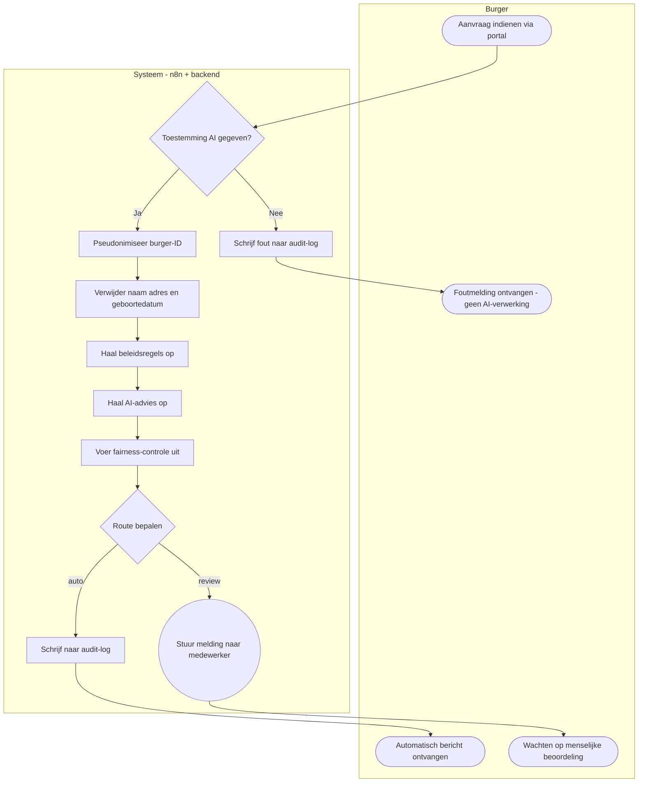
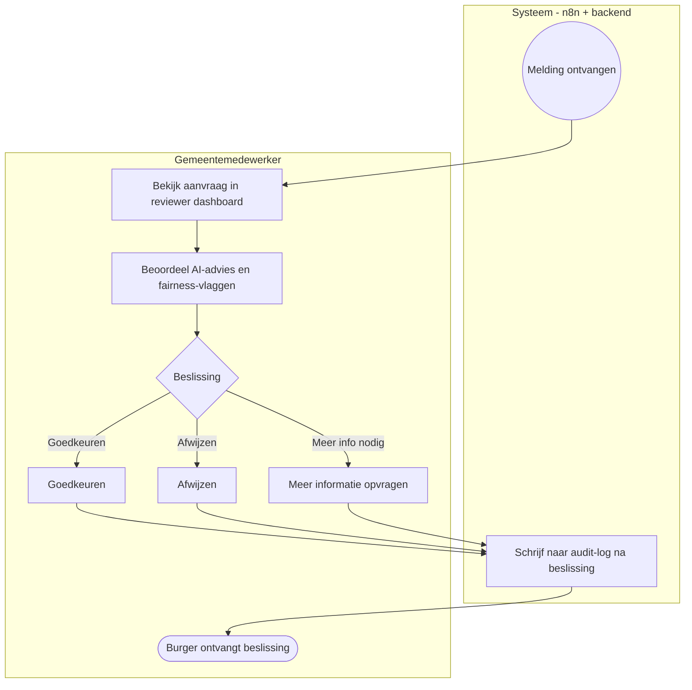

# BPMN — WMO-aanvraagproces

## Inleiding

BPMN (Business Process Model and Notation) is een internationale standaard voor het visueel weergeven van bedrijfsprocessen. Voor het WMO-aanvraagproces maakt dit document duidelijk welke stappen worden doorlopen, wie er verantwoordelijk is en op welke momenten een beslissing wordt genomen. Omdat BPMN-tools niet universeel renderen op GitHub, wordt hier de **Mermaid `flowchart`-notatie** gebruikt met BPMN-conventies: ronde haken voor events, rechthoeken voor taken en ruiten voor beslissingsmomenten (gateways).

Het diagram is opgesplitst in twee delen om de leesbaarheid te bewaren:

- **Diagram 1** — het hoofdproces: van indiening tot routebepaling (Burger + Systeem).
- **Diagram 2** — de reviewstroom: menselijke beoordeling en beslissing (Systeem + Gemeentemedewerker).

---

## Diagram 1 — Hoofdproces

---

## Diagram 2 — Reviewstroom

---

## Lanes en rollen

| Lane | Rol | Verantwoordelijkheid |
|---|---|---|
| **Burger** | Aanvrager | Dient de aanvraag in via het portal en ontvangt berichten over de uitkomst. |
| **Systeem** | n8n + FastAPI backend | Valideert, pseudonimiseert, minimaliseert, haalt beleid en AI-advies op, controleert op fairness, bepaalt de route en schrijft de audit-log. |
| **Gemeentemedewerker** | Reviewer | Beoordeelt aanvragen die naar review zijn gestuurd en neemt de definitieve beslissing. |

---

## Stappentabel

| Stap | Actor | Beschrijving | Trigger volgende stap |
|---|---|---|---|
| 1. Aanvraag indienen | Burger | Burger vult het formulier in via het portal en stuurt de aanvraag op. | Systeem ontvangt `POST /applications`. |
| 2. Toestemming controleren | Systeem | Controleer of `consentForAI` op `true` staat. | Toestemming aanwezig: ga verder. Geen toestemming: schrijf fout en stop. |
| 3. Pseudonimiseren | Systeem | Vervang het burger-ID door een token via HMAC-SHA256. | Token beschikbaar voor verdere verwerking. |
| 4. Data minimaliseren | Systeem | Verwijder naam, adres en exacte geboortedatum. Vervang geboortedatum door leeftijdscategorie. | Geminimaliseerde data klaar voor AI. |
| 5. Beleid ophalen | Systeem | Haal de beleidsregels op via `GET /policy/{provisionType}`. | Beleidscontext beschikbaar voor AI-advies. |
| 6. AI-advies ophalen | Systeem | Vraag een aanbeveling op via `POST /ai/recommend` met geminimaliseerde data. | AI geeft aanbeveling, betrouwbaarheidsscore en risiconiveau terug. |
| 7. Fairness-controle | Systeem | Controleer AI-uitvoer op verboden termen via `POST /fairness/check`. | Fairness-vlaggen beschikbaar voor routebepaling. |
| 8. Route bepalen | Systeem | Bepaal op basis van severity, multipleProblems, risiconiveau, fairness-vlaggen en confidence of de aanvraag automatisch of via review wordt afgehandeld. | Route vastgesteld: `auto` of `review`. |
| 9a. Audit-log schrijven (auto) | Systeem | Schrijf alle gegevens naar de audit-tabel. Stuur automatisch burgerbericht. | Burger ontvangt bericht. Proces klaar. |
| 9b. Melding naar medewerker (review) | Systeem | Stuur melding naar het reviewer-dashboard. | Gemeentemedewerker ziet de aanvraag in de wachtrij. |
| 10. Beoordelen | Gemeentemedewerker | Bekijk de aanvraag, het AI-advies en de fairness-vlaggen in het dashboard. | Medewerker neemt een beslissing. |
| 11. Beslissing | Gemeentemedewerker | Kies: goedkeuren, afwijzen of meer informatie opvragen. | Beslissing wordt doorgegeven aan het systeem. |
| 12. Audit-log bijwerken | Systeem | Registreer de beslissing en de bijbehorende notitie in de audit-tabel. | Burger ontvangt bericht over de uitkomst. |

---

## Paden per testcase

### TC1 — Laag risico, automatische verwerking

> Neutrale aanvraag, geen meervoudige problematiek, lage severity.

**Pad:**
Start -> Toestemming (ja) -> Pseudonimiseer -> Minimaliseer -> Beleid ophalen -> AI-advies (risk=low, confidence=0.9) -> Fairness (geen vlaggen) -> Route=auto -> Audit-log -> **Einde: automatisch burgerbericht**

### TC2 — Hoog risico, menselijke beoordeling vereist

> Aanvraag met severity=hoog en multipleProblems=true.

**Pad:**
Start -> Toestemming (ja) -> Pseudonimiseer -> Minimaliseer -> Beleid ophalen -> AI-advies (risk=high, confidence=0.6) -> Fairness (geen vlaggen) -> Route=review -> Melding naar medewerker -> Dashboard -> Beoordelen -> Beslissing -> Audit-log -> **Einde: burger ontvangt beslissing van medewerker**

### TC3 — Fairness-vlag, menselijke beoordeling vereist

> AI-uitvoer of aanvraagtekst bevat een verboden term (bijv. "religie").

**Pad:**
Start -> Toestemming (ja) -> Pseudonimiseer -> Minimaliseer -> Beleid ophalen -> AI-advies -> Fairness (vlag: forbidden_term:religie) -> Route=review -> Melding naar medewerker -> Dashboard -> Beoordelen -> Beslissing -> Audit-log -> **Einde: burger ontvangt beslissing van medewerker**

### TC4 — Validatiefout, geen AI-verwerking

> Burger heeft geen toestemming gegeven voor AI-verwerking (`consentForAI=false`).

**Pad:**
Start -> Toestemming (nee) -> Fout schrijven naar audit-log -> **Einde: burger ontvangt foutmelding, geen AI-aanroep**

---

## Compliance-aantekeningen

### AVG (Algemene Verordening Gegevensbescherming)

- **Data-minimalisatie** vindt plaats in stap 4, direct na de pseudonimisering en voor elke AI-aanroep. Naam, adres en exacte geboortedatum worden verwijderd. De AI ontvangt uitsluitend de velden `provisionType`, `problemSummary`, `severity`, `ageGroup`, `mobilityIssues`, `multipleProblems` en `householdContext`.
- **Pseudonimisering** in stap 3 zorgt ervoor dat het burger-ID nooit in logs of downstream-services terechtkomt. Alleen het token (`cit_` + HMAC-SHA256-afkorting) wordt opgeslagen.
- **Doelbinding** is vastgelegd via het veld `processing_purpose` in de audit-log. Verwerking buiten dit doel is technisch niet mogelijk via de beschikbare endpoints.
- **Bewaartermijn** wordt geregistreerd via `retention_until` (standaard 90 dagen na aanmaak). Records worden na die datum verwijderd.
- **Recht op inzage** is beschikbaar via `GET /citizen/{token}/data`, conform artikel 15 AVG.

### EU AI Act

- Het systeem is geclassificeerd als **hoog-risico AI-systeem** (Bijlage III, punt 5: AI in de publieke sector voor beoordeling van voordelen en diensten).
- **Menselijk toezicht** is technisch afgedwongen: bij severity=hoog, multipleProblems=true, risk_level=high, fairness-vlaggen of confidence onder de drempelwaarde (standaard 0.7) wordt de aanvraag altijd naar de reviewer-wachtrij gestuurd. Automatische goedkeuring is in die gevallen technisch niet mogelijk.
- **Logging** van elke AI-aanroep bevat: `ai_model`, `ai_confidence`, `risk_level`, `ai_recommendation`, `reasoning`, `fairness_flags`, `final_route` en `created_at`, conform artikel 12 EU AI Act.
- **Transparantie richting burger**: het burgerbericht vermeldt expliciet dat AI een ondersteunende rol heeft gespeeld bij de voorbereiding van de beslissing.
