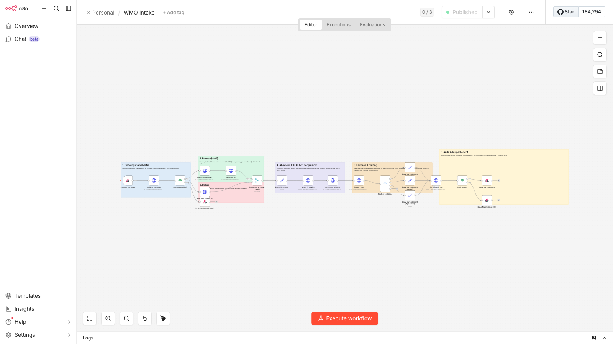
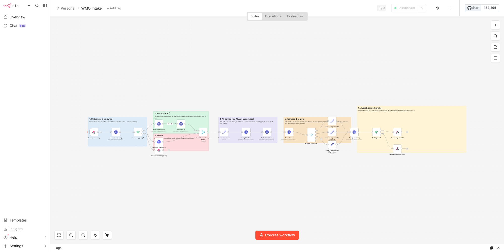

# n8n WMO Intake Workflow

## 1. Inleiding

### Workflow as code

In dit project staat de volledige n8n-workflow opgeslagen als JSON-bestand in de repository. Dit bestand is de enige bron van waarheid voor de orkestratie van een WMO-intakeverzoek. Voordelen van deze aanpak:

- De workflow staat onder versiebeheer samen met de rest van de code.
- Elke wijziging is traceerbaar via git.
- De productieomgeving en de lokale omgeving draaien altijd dezelfde workflow.
- Er is geen handmatige configuratie nodig in de n8n-interface.

Het bestand staat op:

```
n8n/workflows/wmo.json
```

### Automatisch importeren via de init-container

Bij `docker compose up --build` voert Docker Compose de `n8n-import`-container uit voordat n8n zelf start. Deze init-container:

1. Importeert `wmo.json` via de CLI-opdracht `n8n import:workflow`.
2. Activeert de workflow via `n8n update:workflow --id=wmo-intake --active=true`.
3. Sluit zichzelf af (`restart: "no"`).

De `n8n`-container wacht met starten tot `n8n-import` succesvol is afgerond (`condition: service_completed_successfully`). Zo is de webhook direct beschikbaar zodra n8n opstart.

---

## 2. Webhook-eindpunt

De workflow luistert op:

```
POST http://localhost:5678/webhook/wmo-intake
```

### Verzoek (request)

De body volgt de `ApplicationIn`-structuur. Voorbeeld:

```json
{
  "citizenId": "123456789",
  "provisionType": "huishoudelijke_hulp",
  "severity": "laag",
  "multipleProblems": false,
  "problemSummary": "Aanvrager heeft moeite met schoonmaken door gewrichtspijn.",
  "firstName": "Jan",
  "lastName": "Jansen",
  "address": "Voorbeeldstraat 1",
  "dateOfBirth": "1950-03-15",
  "consentForAI": true
}
```

Verplichte velden: `citizenId`, `provisionType`, `severity`, `problemSummary`, `consentForAI`.

Als `consentForAI` de waarde `false` heeft, stopt de workflow direct met een HTTP 400-fout. Er wordt geen AI-aanroep gedaan.

### Antwoord (response)

Bij een succesvolle verwerking geeft de webhook een HTTP 200-respons terug:

```json
{
  "applicationId": "550e8400-e29b-41d4-a716-446655440000",
  "citizenToken": "tok_a1b2c3d4e5f6",
  "route": "auto",
  "riskLevel": "low",
  "aiRecommendation": {
    "recommendation": "toekennen",
    "reasoning": "Aanvraag past binnen beleidskaders. Geen bijzondere risicofactoren.",
    "confidence": 0.92,
    "risk_level": "low",
    "model": "stub-v1"
  },
  "fairnessFlags": [],
  "citizenMessage": "Uw WMO-aanvraag is ontvangen en automatisch beoordeeld. Bij de beoordeling is AI-ondersteuning gebruikt om uw aanvraag voor te bereiden. U ontvangt binnen de wettelijke termijn een officieel besluit."
}
```

De waarde van `route` is altijd `auto`, `review` of `rejected`. Het veld `citizenMessage` bevat een Nederlandstalige tekst op taalniveau B1.

---

## 3. Visuele structuur

### Volledig canvas



### Uitvergrote weergave



De workflow is visueel opgedeeld in zes gekleurde secties via sticky notes. Elke sectie groepeert nodes die bij dezelfde verantwoordelijkheid horen.

### Sectie 1 — Ontvangst & validatie (blauw)

Ontvangt de aanvraag via de webhook en stuurt deze direct naar de backend voor validatie. Als de validatie mislukt, eindigt de workflow hier met een HTTP 400-respons.

### Sectie 2 — Privacy AVG (groen)

Vervangt het `citizenId` door een pseudoniem token en roept de backend aan om persoonsgegevens (naam, adres, geboortedatum) te verwijderen. Vanaf dit punt reist er geen PII meer door de workflow.

### Sectie 3 — Beleid (oranje)

Haalt de geldende WMO-beleidsregels op voor het gevraagde voorzieningstype. Deze stap loopt parallel aan sectie 2.

### Sectie 4 — AI-advies, EU AI Act hoog-risico (paars)

Bouwt een schone AI-context op uit de gepseudonimiseerde gegevens en de beleidsregels. De backend genereert vervolgens een advies met onderbouwing, vertrouwensscore en risiconiveau. Alle invoer- en uitvoergegevens worden gelogd conform de vereisten van de EU AI Act voor hoog-risicosystemen.

### Sectie 5 — Fairness & routing (geel)

Controleert de AI-uitvoer op verboden termen (religie, ras, nationaliteit, geslacht, seksuele geaardheid). Bepaalt daarna of de aanvraag automatisch afgehandeld kan worden of naar een menselijke beoordelaar moet.

### Sectie 6 — Audit & burgerbericht (rood)

Bouwt het Nederlandstalige burgerbericht op, schrijft alle relevante gegevens naar de audit-database (bewaartermijn 90 dagen) en stuurt het definitieve antwoord terug via de webhook.

---

## 4. Node-overzicht

De workflow bevat 26 nodes: 6 sticky notes en 20 functionele nodes. De tabel hieronder beschrijft de functionele nodes in volgorde van uitvoering.

| # | Node | Type | Doel | Backend-aanroep |
|---|------|------|------|-----------------|
| 1 | Ontvang aanvraag | Webhook (v1.1) | Ontvangt het HTTP POST-verzoek en geeft de body door aan de volgende node. Wacht op een expliciete respons-node (`responseMode: responseNode`). | — |
| 2 | Valideer aanvraag | HTTP Request (v4.2) | Stuurt de volledige aanvraag-body naar de backend voor validatie van verplichte velden en AVG-toestemming. | `POST /applications/validate` |
| 3 | Aanvraag geldig? | IF (v2.1) | Controleert of het veld `valid` in de validatierespons `true` is. Output 0 = geldig, output 1 = ongeldig. | — |
| 4 | Stuur foutmelding (400) | Respond to Webhook (v1.1) | Stuurt een HTTP 400-respons terug met een Nederlandstalige foutmelding. Eindpunt van de foutroute. | — |
| 5 | Maak burger-token | HTTP Request (v4.2) | Pseudonimiseert het `citizenId` naar een herhaalbaar token. Loopt parallel aan node 6. | `POST /pseudonymize` |
| 6 | Haal WMO-beleid op | HTTP Request (v4.2) | Haalt de beleidsregels op voor het gevraagde voorzieningstype. Loopt parallel aan node 5. | `GET /policy/{provisionType}` |
| 7 | Verwijder PII | HTTP Request (v4.2) | Verwijdert naam, adres en exacte geboortedatum uit de aanvraag. Geeft een geminimaliseerde dataset terug met onder andere `ageGroup`. | `POST /minimize` |
| 8 | Combineer privacy + beleid | Merge (v3.1) | Voegt de resultaten van de privacytak (nodes 5-7) en de beleidstak (node 6) samen via `combineAll`. | — |
| 9 | Bouw AI-context | Set (v3.2) | Selecteert alleen de velden die de AI-service nodig heeft: `citizenToken`, `provisionType`, `ageGroup`, `severity`, `multipleProblems`, `problemSummary`, `policy`. Bevat geen PII. | — |
| 10 | Vraag AI-advies | HTTP Request (v4.2) | Stuurt de schone AI-context naar de backend. Ontvangt `recommendation`, `reasoning`, `confidence`, `risk_level` en `model`. | `POST /ai/recommend` |
| 11 | Controleer fairness | HTTP Request (v4.2) | Stuurt de AI-uitvoer naar de fairness-service. Geeft een lijst van `flags` terug als verboden termen zijn gevonden. | `POST /fairness/check` |
| 12 | Bepaal route | HTTP Request (v4.2) | Combineert severity, multipleProblems, risk_level, fairness-flags en confidence. Geeft de definitieve `route` terug: `auto`, `review` of `rejected`. | `POST /route/decide` |
| 13 | Routeer beslissing | Switch (v1) | Leidt de flow naar de juiste burgerbericht-node op basis van de `route`-waarde. Output 0 = auto, output 1 = review, output 2 (fallback) = rejected. | — |
| 14 | Bouw burgerbericht (auto) | Set (v3.2) | Stelt het B1-burgerbericht in voor de automatische route. | — |
| 15 | Bouw burgerbericht (review) | Set (v3.2) | Stelt het B1-burgerbericht in voor de review-route. Vermeldt expliciet dat een medewerker meekijkt. | — |
| 16 | Bouw burgerbericht (afgewezen) | Set (v3.2) | Stelt het B1-burgerbericht in voor de afgewezen route. Verwijst naar persoonlijk contact met de gemeente. | — |
| 17 | Schrijf audit-log | HTTP Request (v4.2) | Persisteert alle relevante velden naar de audit-database: token, voorzieningstype, severity, route, risiconiveau, fairness-flags, AI-advies, onderbouwing en besluitstatus. | `POST /audit/write` |
| 18 | Audit gelukt? | IF (v2.1) | Controleert of de audit-respons een `applicationId` bevat. Output 0 = gelukt, output 1 = mislukt. | — |
| 19 | Stuur burgerbericht | Respond to Webhook (v1.1) | Stuurt de definitieve HTTP 200-respons terug aan de aanroeper. Bevat `applicationId`, `citizenToken`, `route`, `riskLevel`, `aiRecommendation`, `fairnessFlags` en `citizenMessage`. | — |
| 20 | Stuur foutmelding (500) | Respond to Webhook (v1.1) | Stuurt een HTTP 500-respons terug als de audit-schrijfactie is mislukt. Eindpunt van de backend-foutroute. | — |

---

## 5. Parallellisatie

Na de `Aanvraag geldig?`-node splitst de flow op in twee takken die tegelijk worden uitgevoerd:

**Tak A — Privacy:**
`Maak burger-token` -> `Verwijder PII`

**Tak B — Beleid:**
`Haal WMO-beleid op`

Beide takken komen samen in `Combineer privacy + beleid` (Merge-node, mode `combineAll`).

De parallellisatie is mogelijk omdat de twee takken onafhankelijk van elkaar zijn:

- Tak A heeft alleen `citizenId` nodig om het token te maken en de PII te verwijderen.
- Tak B heeft alleen `provisionType` nodig om de beleidsregels op te halen.

Door de stappen parallel uit te voeren, is de totale doorlooptijd korter dan wanneer ze na elkaar zouden lopen. De `combineAll`-instelling van de Merge-node zorgt ervoor dat de gecombineerde output altijd het resultaat van beide takken bevat voordat de flow verdergaat.

---

## 6. Routing-switch

De `Routeer beslissing`-node is van het type Switch (v1) en werkt op basis van de waarde van `$json.route`:

| Output | Waarde | Volgende node |
|--------|--------|---------------|
| 0 | `auto` | Bouw burgerbericht (auto) |
| 1 | `review` | Bouw burgerbericht (review) |
| 2 (fallback) | alles anders | Bouw burgerbericht (afgewezen) |

De drie burgerbericht-nodes convergeren daarna allemaal naar `Schrijf audit-log`. De auditfase en de respons zijn dus identiek voor alle drie de routes; alleen de tekst van het burgerbericht verschilt.

**Opmerking over de afgewezen-route:**
In de huidige implementatie kan `consentForAI=false` de afgewezen-route nooit bereiken. Een aanvraag zonder toestemming mislukt al bij de validatiecheck (node 3) en eindigt bij de HTTP 400-foutmelding. De afgewezen-lane is behouden voor toekomstige uitbreidingen, bijvoorbeeld wanneer een aanvraag op beleidsgronden automatisch buiten scope valt.

---

## 7. Foutafhandeling

De workflow kent twee expliciete foutpaden:

**HTTP 400 — Validatiefout**

Wordt geactiveerd wanneer `Aanvraag geldig?` de ongeldigde tak (output 1) volgt. De respons bevat:

```json
{
  "error": "Validatie mislukt",
  "errors": [],
  "message": "Uw aanvraag kan niet worden verwerkt. Controleer of u toestemming heeft gegeven (consentForAI=true) en alle verplichte velden heeft ingevuld."
}
```

**HTTP 500 — Backend-storing**

Wordt geactiveerd wanneer `Audit gelukt?` detecteert dat de audit-schrijfactie geen `applicationId` heeft teruggegeven. Dit kan gebeuren bij een databasestoring of een netwerkprobleem met de backend. De respons bevat:

```json
{
  "error": "Verwerking mislukt",
  "details": "Er is een technische fout opgetreden bij het verwerken van uw aanvraag. Probeer het later opnieuw of neem contact op met de gemeente."
}
```

Alle HTTP Request-nodes hebben `continueOnFail: true`. Hierdoor blijft de flow actief bij een mislukte backend-aanroep en kan de workflow zelf de fout detecteren en een passende respons sturen in plaats van stil te falen.

---

## 8. Privacy-verloop door de workflow

De onderstaande tabel laat zien welke nodes nog toegang hebben tot persoonsgegevens (PII).

| Fase | Nodes | PII aanwezig |
|------|-------|-------------|
| Ontvangst | Ontvang aanvraag, Valideer aanvraag, Aanvraag geldig? | Ja — volledige body inclusief naam, adres, geboortedatum en citizenId. |
| Pseudonimisering | Maak burger-token | Ja — ontvangt citizenId om het token te genereren, geeft alleen het token terug. |
| Minimalisatie | Verwijder PII | Ja — ontvangt de volledige body, geeft een geminimaliseerde versie terug zonder naam, adres en exacte geboortedatum. Retourneert `ageGroup` in plaats van `dateOfBirth`. |
| Na minimalisatie | Combineer privacy + beleid, Bouw AI-context en alle volgende nodes | Nee — alleen `citizenToken`, `ageGroup` en niet-identificerende velden. |

Vanaf `Bouw AI-context` bevat geen enkele node, logvermelding of backend-aanroep nog directe persoonsgegevens. Het token is herleidbaar naar de burger via de backend-pseudonimiseringsservice, maar alleen met de geheime sleutel (`PSEUDONYM_SECRET`).

---

## 9. Workflow opnieuw importeren

Wanneer `wmo.json` is gewijzigd en n8n al draait, kan de workflow opnieuw worden geimporteerd zonder alle containers opnieuw te bouwen:

```bash
docker compose rm -f n8n-import
docker compose up -d n8n-import n8n
```

Docker start de init-container opnieuw, importeert de gewijzigde workflow en herstart n8n.

Voor een volledige reset inclusief alle volumes en databasegegevens:

```bash
docker compose down -v
docker compose up --build
```

Let op: `down -v` verwijdert alle persistente data, inclusief audit-logs en n8n-executions.

---

## 10. Workflow handmatig testen

### Via de n8n-interface

1. Open de n8n-interface op `http://localhost:5678`.
2. Log in met gebruikersnaam `admin` en wachtwoord `admin_local_dev`.
3. Voltooi de eenmalige owner-setup als n8n hierom vraagt.
4. Open de workflow "WMO Intake".
5. Klik op "Execute workflow" om een testrun te starten.
6. Bekijk de executions-log voor het resultaat van elke node.

### Via de commandoregel

Testcase 1 — laag risico, automatische afhandeling:

```bash
curl -s -X POST http://localhost:5678/webhook/wmo-intake \
  -H "Content-Type: application/json" \
  -d '{
    "citizenId": "111111111",
    "provisionType": "huishoudelijke_hulp",
    "severity": "laag",
    "multipleProblems": false,
    "problemSummary": "Aanvrager heeft moeite met schoonmaken door gewrichtspijn.",
    "firstName": "Anna",
    "lastName": "de Vries",
    "address": "Teststraat 1",
    "dateOfBirth": "1948-06-20",
    "consentForAI": true
  }' | python3 -m json.tool
```

Testcase 2 — hoog risico, human-in-the-loop:

```bash
curl -s -X POST http://localhost:5678/webhook/wmo-intake \
  -H "Content-Type: application/json" \
  -d '{
    "citizenId": "222222222",
    "provisionType": "rolstoel",
    "severity": "hoog",
    "multipleProblems": true,
    "problemSummary": "Aanvrager heeft meerdere beperkingen en is afhankelijk van zorg.",
    "firstName": "Piet",
    "lastName": "Bakker",
    "address": "Voorbeeldlaan 5",
    "dateOfBirth": "1935-11-03",
    "consentForAI": true
  }' | python3 -m json.tool
```

Testcase 4 — geen toestemming, verwacht HTTP 400:

```bash
curl -s -o /dev/null -w "%{http_code}" -X POST http://localhost:5678/webhook/wmo-intake \
  -H "Content-Type: application/json" \
  -d '{
    "citizenId": "444444444",
    "provisionType": "woningaanpassing",
    "severity": "gemiddeld",
    "multipleProblems": false,
    "problemSummary": "Aanvrager heeft een drempelvrije toegang nodig.",
    "firstName": "Maria",
    "lastName": "Smit",
    "address": "Kerkstraat 10",
    "dateOfBirth": "1960-01-01",
    "consentForAI": false
  }'
```

De executions-log in de n8n-interface toont per run welke nodes zijn uitgevoerd, welke data er doorheen ging en hoelang elke stap duurde. Dit is bruikbaar voor het debuggen van onverwachte routes of backend-fouten.
